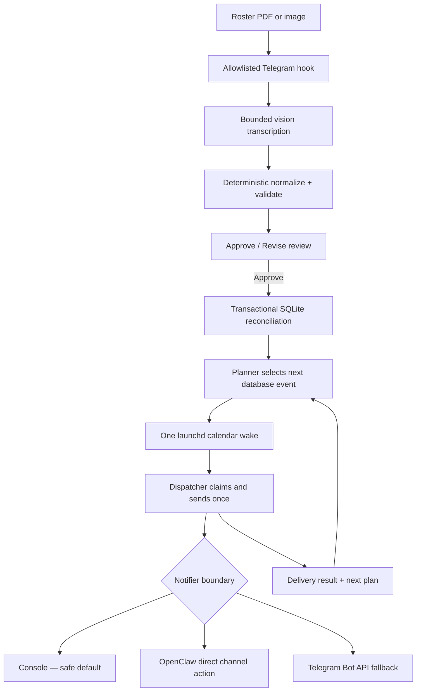

# wife-roster

A privacy-first, deterministic workflow that turns airline crew-roster uploads
into reviewed, edit-aware alerts.

The interesting part is not sending a message. It is preserving a strict trust
boundary: vision may transcribe a roster, but code owns every date, timezone,
validation rule, diff, approval, database write, schedule decision, retry, and
delivery record.

> **Portfolio snapshot:** this public repository contains source, fictional
> fixtures, tests, and documentation only. It contains no production roster,
> Telegram identifier, credential, database, log, or delivery target.

## What it demonstrates

- A bounded AI edge: image/PDF transcription produces a pinned JSON schema and
  has no authority to schedule or send.
- Deterministic roster logic: port-local dates and times, duty grouping,
  timezone conversion, validation, stable hashes, and human-readable diffs.
- Explicit human approval: an upload creates a private review; only an
  allowlisted approval can activate it.
- Transactional reconciliation: full rosters replace covered months, partial
  evidence merges conservatively, and obsolete unsent alerts are superseded.
- Edit-aware scheduling without polling: SQLite selects one next wake, and a
  macOS `launchd` calendar job runs the dispatcher once.
- Idempotent delivery: atomic claims, schedule generations, bounded retries,
  immutable sent history, and durable attempt records.
- Fail-closed adapters: fresh installations use console output; Telegram or
  OpenClaw delivery must be selected and configured explicitly.

## Architecture



SQLite is authoritative. `launchd` stores only the next wake and contains no
flight logic, so an old calendar invocation cannot send a superseded alert.
Scheduled delivery never invokes an agent or model.

For state transitions, replacement rules, retry windows, and operational
dependencies, see [Scheduling architecture](docs/architecture.md). The exact
public/private boundary is recorded in
[Public snapshot boundary](docs/publication-scope.md).

## Safe local demo

Requirements: Python 3.11+; Node.js 20+ only if you want to run the inbound
plugin tests.

```bash
python3 -m venv .venv
.venv/bin/pip install -e '.[test]'
.venv/bin/roster ingest tests/fixtures/synthetic_roster.json --dry-run
.venv/bin/pytest -q
```

The included fixture uses a fictional `ZX` carrier, distant 2037 dates, and no
personal identifiers. A dry run prints the normalized review without applying
state or configuring delivery.

Run the JavaScript boundary tests separately:

```bash
cd openclaw-plugin
npm ci
npm test
```

## Processing contract

Roster times remain port-local and primary. Singapore equivalents are display
annotations only. A sector is schedulable only when its flight, route, STD,
STA, airport metadata, local times, and critical cells are valid. Unknown or
ambiguous inputs become `NEEDS REVIEW`; the system never invents a report time
or silently guesses a timezone.

For each valid future duty, the workflow plans 12-hour and 3-hour preparation
alerts. For each valid future sector, it plans a landing alert one hour before
STA. Stable event keys describe the event itself rather than a roster version,
which prevents duplicate sends after equivalent uploads.

The pinned transcription schema and full normalization rules are documented in
[SPEC.md](SPEC.md).

## Review and approval boundary

The optional OpenClaw plugin handles only a narrow command set in one privately
configured Telegram group:

```text
/ping@RosterDemoBot
/run_wife_roster@RosterDemoBot    (with PDF/PNG/JPG/JPEG evidence)
/approve_roster@RosterDemoBot
```

Group, sender, state-change sender, and bot allowlists are runtime
configuration—not source constants. Uploads are copied into a private ingestion
directory. Review does not initialize or mutate SQLite. Approval rechecks the
source hashes, transcription, normalized content, report period, coverage, and
review issues before calling the single transactional apply path.

Approvals are idempotent, newer reviews supersede older pending reviews, and a
full roster replaces all duties and unsent alerts in its covered calendar
months. Partial or uncertain evidence never deletes unrelated duties.

## Scheduler and retry model

The planner runs when the user session loads and when a private schedule signal
changes. It arms one `StartCalendarInterval` for the earliest of:

1. a pending alert's due time;
2. a failed alert's explicit retry time; or
3. an abandoned `sending` claim's lease expiry.

The dispatcher atomically claims eligible rows, verifies the current schedule
generation, sends through the selected notifier, records the result, and asks
the planner for the next wake. Delivery gets at most three attempts with 5- and
15-minute backoff, provided a retry still falls inside the alert-specific grace
window.

This is a logged-in-user macOS scheduler. At delivery time the Mac and user
session must be available, the configured messaging client must work, and the
network must be reachable. The workflow can recover a recent late wake within
grace; it does not alter power or sleep settings.

## Notifier selection

`WIFE_ROSTER_NOTIFIER` accepts exactly `console`, `openclaw`, or `telegram`.
Missing or blank configuration selects `console`; unknown values fail closed.
Credentials never select a route implicitly.

Copy `.env.example` to a machine-local `.env` only when configuring a private
runtime. Never commit it. The OpenClaw adapter requires an executable path,
account, and target. The Telegram fallback requires a bot token and target IDs.
Neither is populated in this repository.

## Repository map

```text
src/roster/             deterministic Python domain and runtime adapters
openclaw-plugin/        allowlisted Telegram review/approval boundary
prompts/                transcription-only schema prompt
tests/                  fictional unit and integration fixtures
docs/architecture.md    state, scheduling, retry, and privacy design
SPEC.md                 deterministic processing contract
.env.example            inert configuration template
```

## Production separation

The deployment command copies an allowlisted application bundle to the user's
Application Support directory. Stable state stays outside that replaceable
bundle: database, logs, private inbox, and `.env`. Redeployment does not copy
development runtime data or overwrite production state.

Runtime/private directories are restricted to the user, and sensitive files
are created with private permissions. The generated user agents use a private
umask and absolute runtime paths. See [SECURITY.md](SECURITY.md) before adapting
the workflow.

## Tests and CI

The Python suite exercises parsing, validation, display, alert timing,
reconciliation, scheduler generation, dispatch claims, retries, notifier
failure handling, review authorization, and deployment boundaries. The Node
suite exercises command scoping, mention policy, attachments, callbacks, and
workflow invocation. GitHub Actions runs both suites on every push and pull
request.

## License

[MIT](LICENSE). This project is a technical demonstration, not an airline
operations service; evaluate its rules and deployment model independently
before using it for a real schedule.
